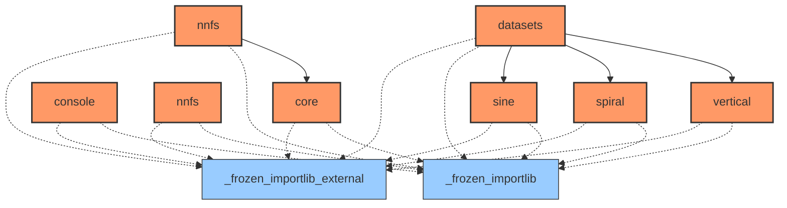
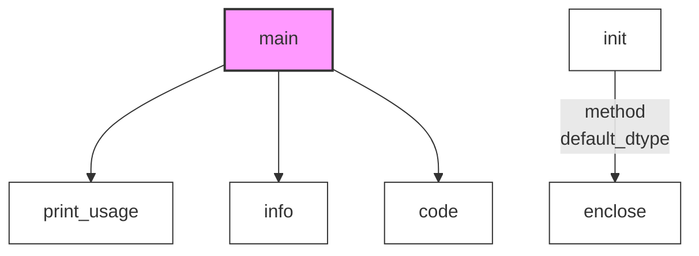

# Documentation for `nnfs`
> **Note:** Analyzed via CLI command `nnfs`.
**File Path:** `/usr/local/lib/python3.12/dist-packages/nnfs/__init__.py`

## 🚦 Navigator: How to Drive
This section helps you understand how to run this library from the command line or entry points.

### 💻 Installed CLI Commands
This library installs the following system commands (accessible from terminal):
| Command | Entry Point (Function) |
| :--- | :--- |
| `nnfs` | `nnfs.console.nnfs:main` |

- ✅ **Target Match**: You are analyzing the package backing the command `nnfs`.

### 🐍 Python API Usage (Inferred)
Since no CLI entry point was found, here are the likely **Python API entry points** for your script:

#### 🚀 Top 20 Recommended Entry Points
| Type | API | Description |
| :--- | :--- | :--- |
| `ƒ` | **nnfs.init**(dot_precision_workaround, default_dtype, random_seed) | No description. |

> **Note:** Bold parameters are required. Others are optional.

#### 🧩 Code Snippets (Auto-Generated)
```python
import nnfs

# --- Top 20 Ranked Functions ---
# 1. init
result_1 = nnfs.init()

```

_No explicit `argparse` configuration detected in the main module._


## 📊 Network & Architecture Analysis
### 🌍 Top 20 External Dependencies
| Library | Usage Count |
| :--- | :--- |
| **_frozen_importlib_external** | 8 |
| **_frozen_importlib** | 8 |


### 🕸️ Network Metrics (Advanced)
#### 👑 Top 20 Modules by PageRank (Authority)
| Rank | Module | Score | Type | Role |
| :--- | :--- | :--- | :--- | :--- |
| 1 | `_frozen_importlib_external` | 0.2484 | External | External Lib |
| 2 | `_frozen_importlib` | 0.2484 | External | External Lib |
| 3 | `core` | 0.0734 | Internal | Data Processing |
| 4 | `datasets.sine` | 0.0670 | Internal | Data Processing |
| 5 | `datasets.spiral` | 0.0670 | Internal | Data Processing |
| 6 | `datasets.vertical` | 0.0670 | Internal | Data Processing |
| 7 | `nnfs` | 0.0572 | Internal | Utility / Core |
| 8 | `console` | 0.0572 | Internal | Unknown |
| 9 | `console.nnfs` | 0.0572 | Internal | Utility / Core |
| 10 | `datasets` | 0.0572 | Internal | Utility / Core |


### 🗺️ Dependency & Architecture Map


## 🚀 Global Execution Flow & Extraction Guide
This graph visualizes how data flows between functions across the entire project.


### ✂️ Navigator: Snippet Extractor
Want to use a specific function without the whole library? Here is the **Dependency Closure** for **Top 20** key functions.
#### To extract `main`:
> You need these **4** components:
`code, info, main, print_usage`

#### To extract `init`:
> You need these **2** components:
`enclose, init`

## 📑 Top-Level API Contents & Logic Flow
### 🔧 Functions
#### `init(dot_precision_workaround=True, default_dtype='float32', random_seed=0)`
> No documentation available.
<details><summary>Full Docstring</summary>

```text
No documentation available.
```
</details>